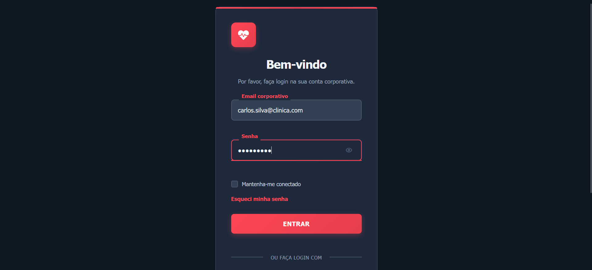
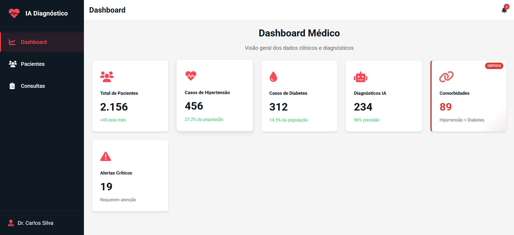
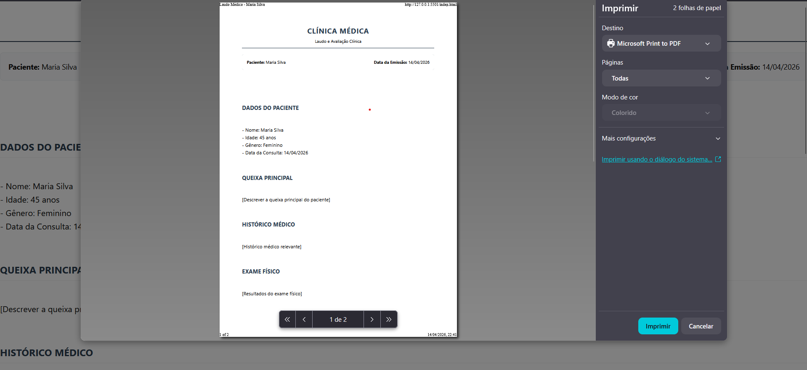

# 🚀 Sprint Review e Evidências de Execução

**Projeto:** IA Diagnóstico - Hipertensão & Diabetes  
**Data da Review:** 07/04  
**Sprint:** 01  

---

## 🎯 1. Relembrando o Objetivo da Sprint
Implementar a navegabilidade entre seções e a lógica de exibição dinâmica de dados dos pacientes, permitindo que o médico visualize informações clínicas e gere laudos simulados com suporte de IA.

---

## ✅ 2. O Que Foi Entregue (Incremento do Produto)
Nesta Sprint, a equipe obteve uma entrega de **62 Story Points**, superando a meta inicial de 24 SP. As principais funcionalidades demonstradas na Review foram:

1. **Dashboard Funcional:** Indicadores de hipertensão/diabetes atualizados em tempo real.
2. **Navegação SPA:** Transição fluida entre abas (Dashboard, Pacientes, Consultas) sem recarregar a página.
3. **Perfis de Pacientes e Gráficos:** Listagem dinâmica via JSON com gráficos de histórico clínico integrados via `Chart.js`.
4. **Motor de IA (Diagnóstico):** Geração automática de laudos embasados nos dados clínicos reais do paciente (Queixa, Exame Físico, Plano Terapêutico).
5. **Impressão de Laudos:** Funcionalidade nativa configurada para formatar o laudo como um documento padrão A4.
6. **Tela de Login Corporativa:** Funcionalidade extra entregue antecipadamente (US13) garantindo controle de sessão (Dr. Carlos Silva / Dra. Ana Costa).

---

## 📸 3. Evidências de Execução (Telas do Sistema)

> **Nota:** As imagens a seguir comprovam o desenvolvimento da interface e do código em pleno funcionamento durante a execução da Sprint.

### Tela de Login (US13)

*Acesso restrito via autenticação validada via JavaScript e persistência no LocalStorage.*

### Dashboard Médico (US01 e US02)

*Indicadores com formatação condicional (alertas críticos em vermelho) e menus funcionais.*

### Detalhes do Paciente e Diagnóstico IA (US05 e US06)

*Motor IA gerando condutas médicas baseadas nos níveis de pressão e glicemia registrados.*

---

## 🗣️ 4. Feedback dos Stakeholders / Professores
Durante a apresentação, os seguintes pontos foram levantados:
* **Pontos Positivos:** O visual (UI/UX) agradou muito, especialmente os gráficos dinâmicos e a formatação limpa da impressão do laudo. A antecipação da tela de Login demonstrou boa capacidade técnica.
* **Oportunidade de Melhoria:** Com a lista de pacientes crescendo, a ausência de uma barra de busca ou filtro ficou evidente.

**Status da Review:** ✅ Aprovada e validada.